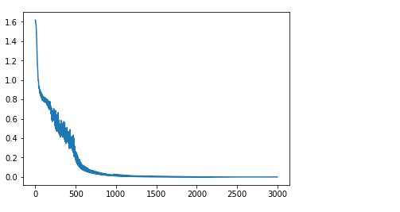

# Sequence Prediction using RNN
In this project we used a Recurrent Neural Network (comprised of LSTM cells) for predicting the second half of a series of sequences. The training sequences are as follows:

aanbbe
aaanbbbe
aaaanbbbbe
....

abnbae
ababnbabae
abababnbababae
ababababnbabababae
.....

we used the first half of these sequences as inputs and the second half as targets. After 300 epochs the results for two sets of sequences are as follows:

## first set of sequences:

### network's loss & created sequences:

